# Brim

One package manager for every source Fedora can pull from.

Brim searches DNF, Flatpak, COPR and AppImage in a single box, shows you what
is installed and exactly what will change, and applies it. Built with PySide6
and libdnf5, themed by Breeze, and it keeps itself up to date.

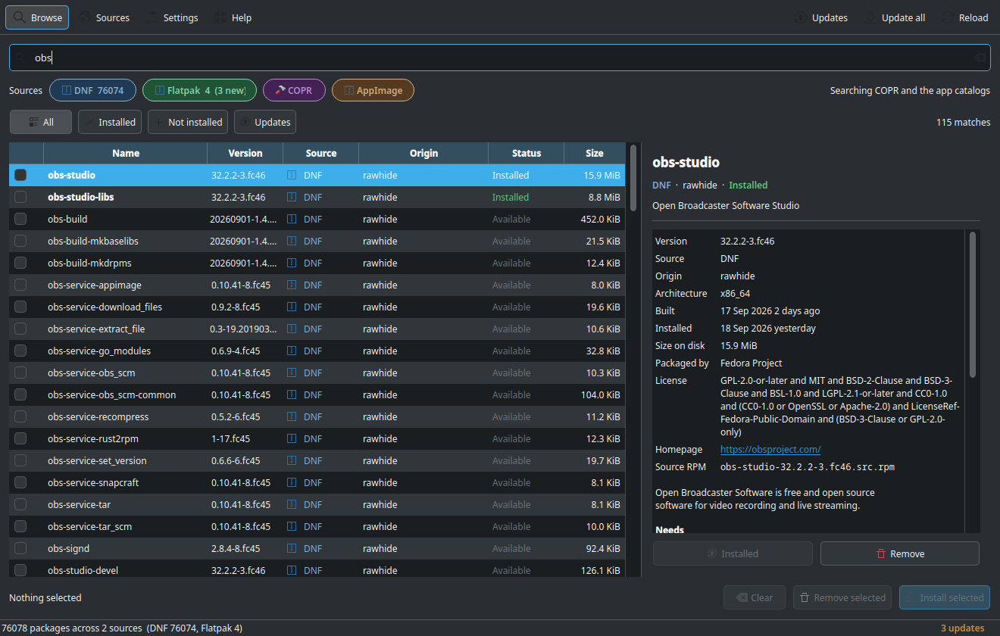

<details>
<summary>The same window in Breeze Light</summary>

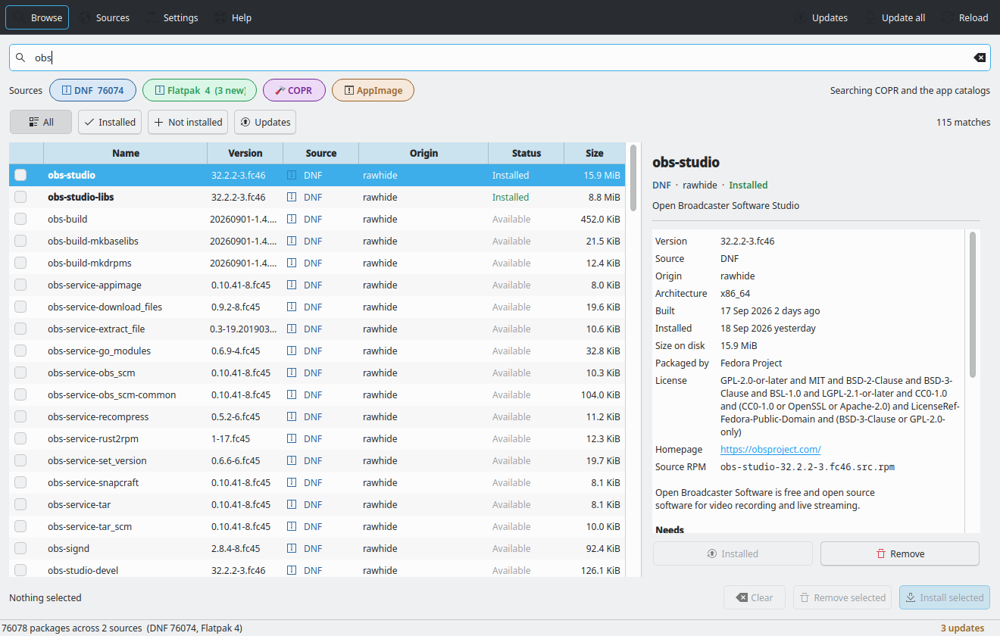

</details>

### See what a transaction will actually do

No guessing about dependencies. Brim resolves the transaction first and lists
every package coming along, with its size and why it is there.

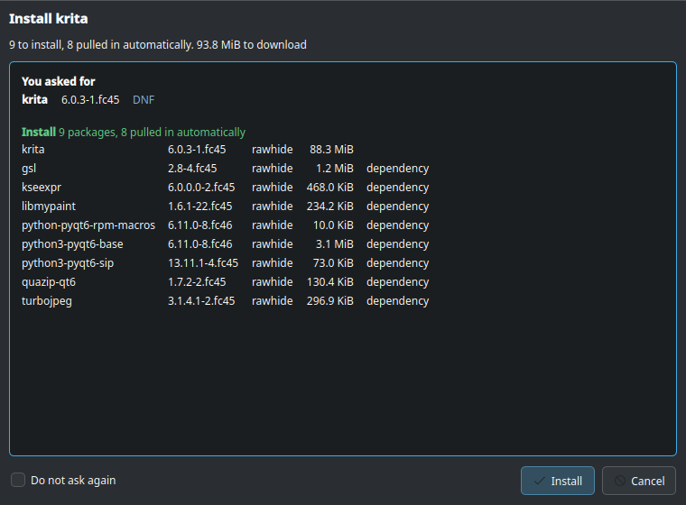

### Every source in one place

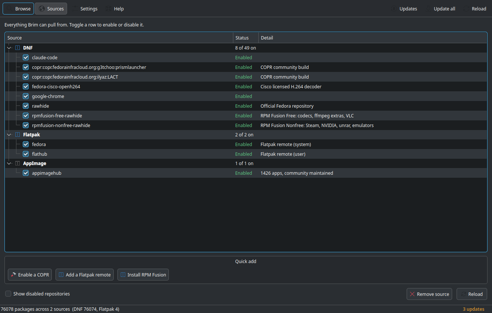

### Honest about what community sources cost you

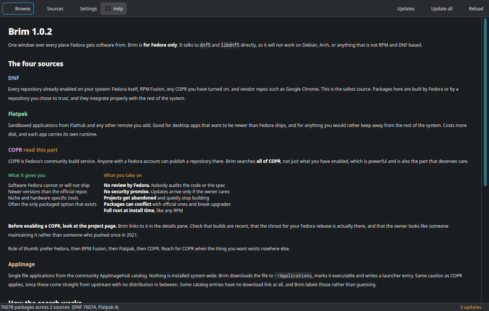

<details>
<summary>More screenshots</summary>

**Updates, from every source at once**

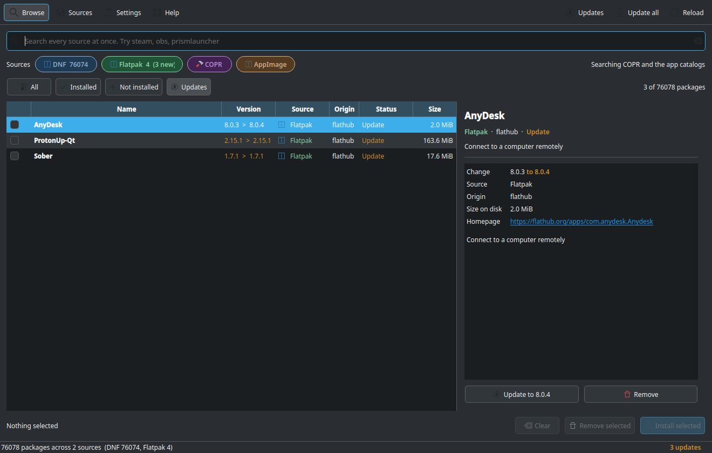

**Settings**

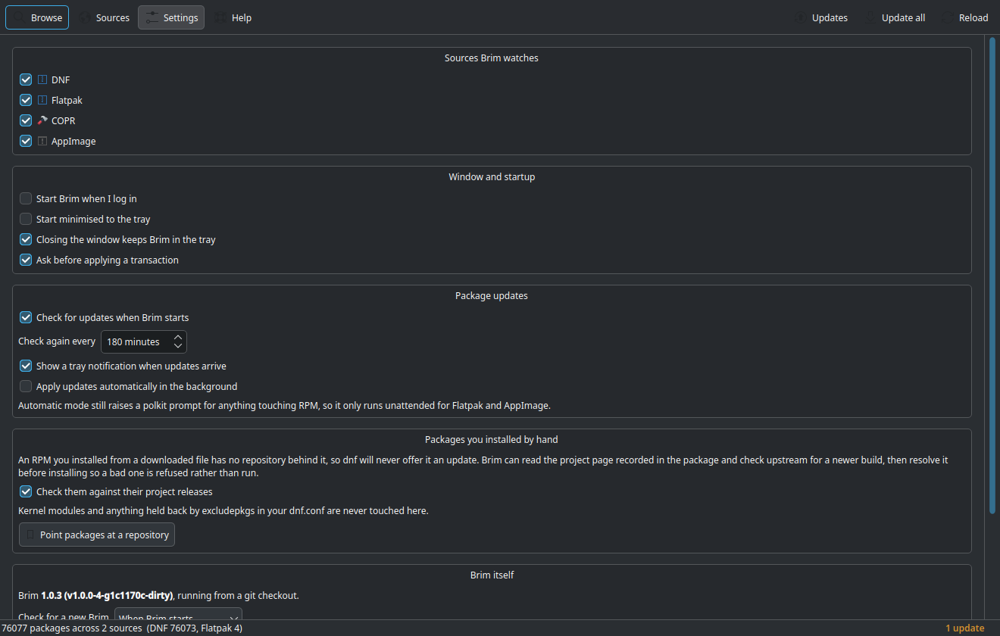

**Breeze Light**

| | |
| --- | --- |
| 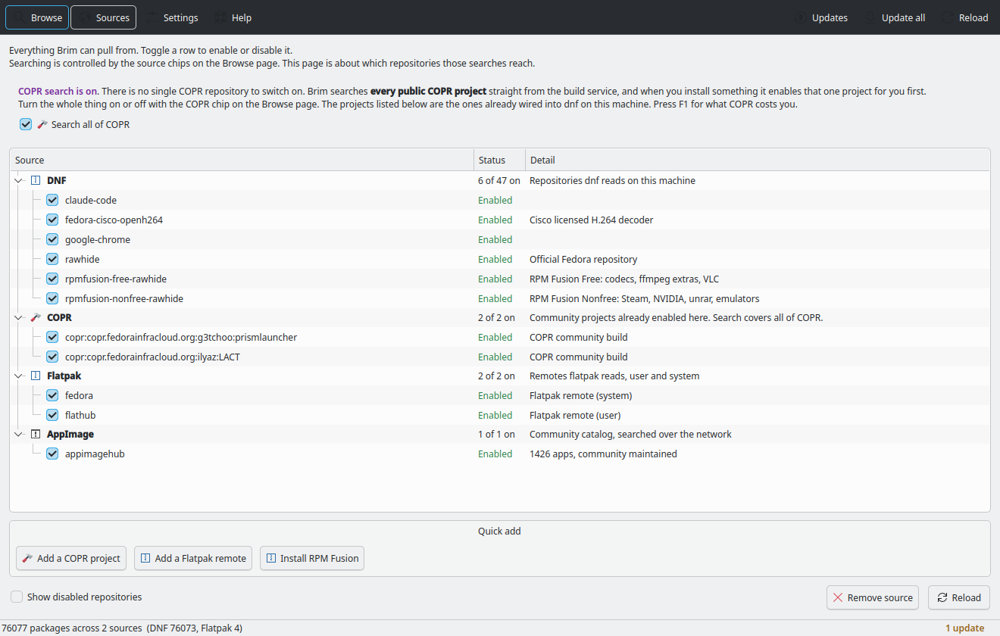 | 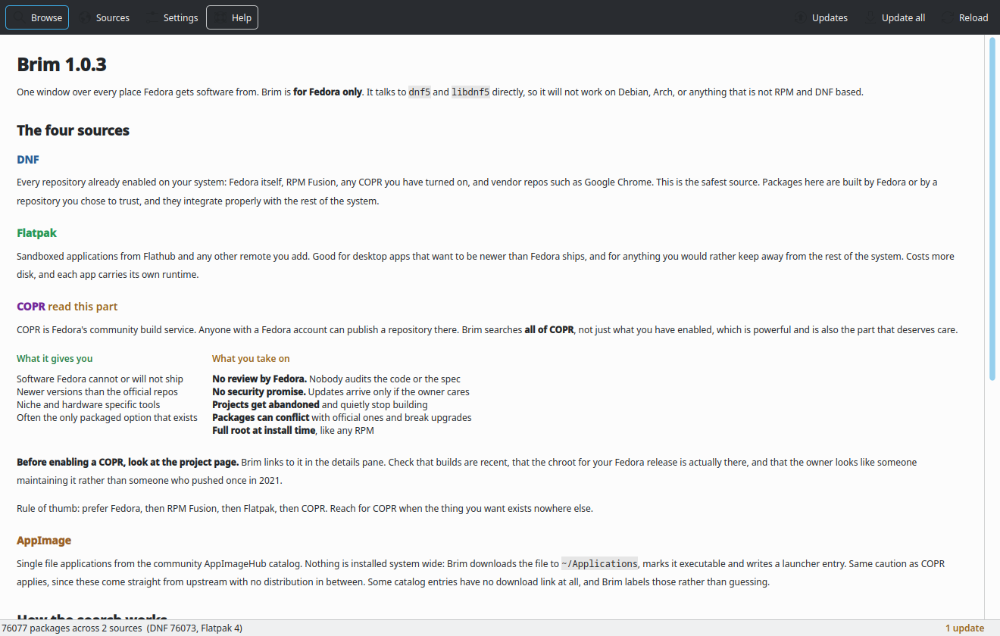 |
| 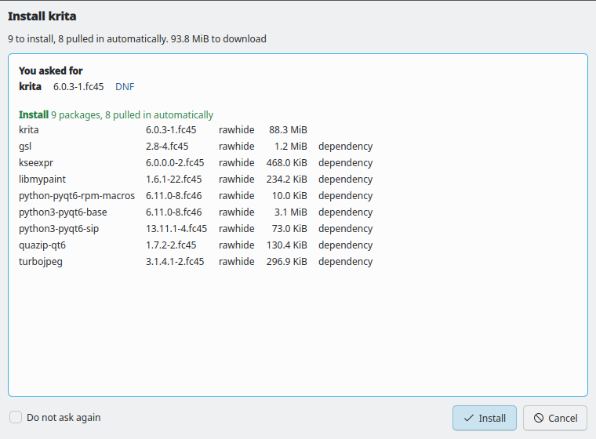 | 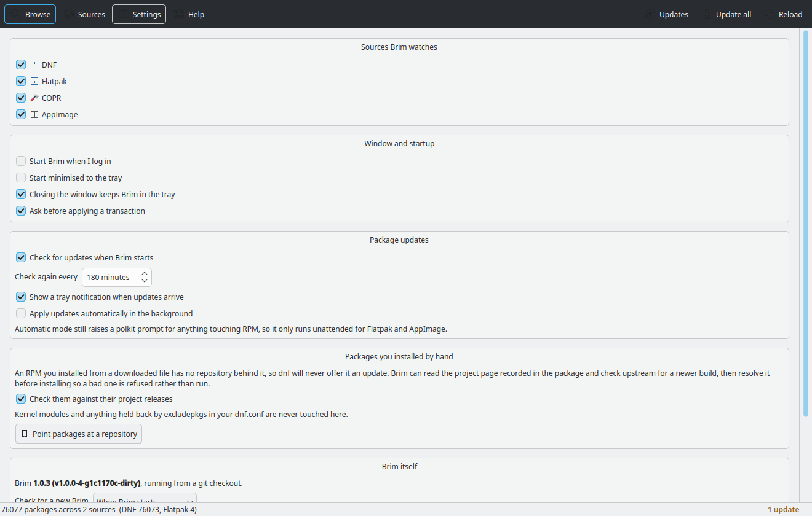 |

</details>

## Why

Fedora spreads its software across four worlds that do not talk to each other.
Discover hides the low level detail. dnfdragora only knows RPM. Nothing reaches
into COPR before you have already enabled a project, and nothing at all handles
AppImages. Brim covers all four in one window.

| Source | What Brim does |
| --- | --- |
| DNF | Reads every enabled repo through libdnf5, no PackageKit in the way |
| Flatpak | All remotes, user and system, with real descriptions and sizes |
| COPR | Searches every public project, not just the ones already enabled |
| AppImage | Searches the AppImageHub catalog, downloads and wires up a launcher |
| Hand installed RPMs | Checks upstream releases for packages no repository watches |

## Speed

libdnf5 is read directly instead of through a daemon.

```
76000 packages indexed in 0.65s
```

## Install

One line. It picks the right method for your machine.

```sh
curl -fsSL https://raw.githubusercontent.com/gabrielmf1998/Brim-KDE-Fedora-Package/main/get-brim.sh | bash
```

Piping a script into a shell deserves a second thought, so read it first if
you prefer:

```sh
curl -fsSLO https://raw.githubusercontent.com/gabrielmf1998/Brim-KDE-Fedora-Package/main/get-brim.sh
less get-brim.sh && bash get-brim.sh
```

### Or pick a method yourself

**RPM**, the normal way. Integrates with dnf and updates like any package.

```sh
sudo dnf install https://github.com/gabrielmf1998/Brim-KDE-Fedora-Package/releases/latest/download/brim-1.0.0-1.fc46.noarch.rpm
```

**AppImage**, one file, no root, nothing installed system wide.

```sh
curl -fsSL https://raw.githubusercontent.com/gabrielmf1998/Brim-KDE-Fedora-Package/main/get-brim.sh | bash -s -- --method appimage
```

The AppImage is deliberately thin. Brim drives your package manager, so it has
to use your system's own `python3-libdnf5`; bundling a copy would be the wrong
version the moment dnf5 moves. It needs `python3-pyside6` and `python3-libdnf5`
present, and the installer puts them there for you.

**From source**, for hacking on it.

```sh
git clone https://github.com/gabrielmf1998/Brim-KDE-Fedora-Package
cd brim && ./install.sh && brim
```

### Uninstall

```sh
curl -fsSL https://raw.githubusercontent.com/gabrielmf1998/Brim-KDE-Fedora-Package/main/get-brim.sh | bash -s -- --uninstall
```

## Fedora only, on purpose

Brim links against `libdnf5` and speaks DNF5. It works on Fedora, Nobara,
Ultramarine, RHEL 10 and other DNF5 based systems. It will not work on Debian,
Ubuntu, Arch, openSUSE or anything that is not RPM and DNF based, and the
installer refuses rather than half working.

## What it does

**Browse.** One search box across every source. Filter by source with the chips
at the top, filter by state with All, Installed, Not installed and Updates.
Local results appear as you type and network catalogs fill in behind them.

**See the change.** An upgradable package shows `8.0.3 > 8.0.4` right in the
list, so you always know what a transaction will actually do.

**Sources.** Enable or disable any dnf repo, add a COPR, add a Flatpak remote,
or install RPM Fusion in one click. Disabled repos are hidden until you ask.

**Dependencies, up front.** Yes, it pulls them. More to the point it shows you
which ones before anything runs: the full resolved list, each package's size,
and whether it is a hard requirement or an optional extra. If the transaction
cannot be resolved, you see why instead of a failure halfway through.

**Real package detail.** When it was built, when you installed it, who packaged
it, the source RPM, what it needs, what it suggests, and its recent changelog.

**Packages you installed by hand.** An RPM you installed from a downloaded file
has no repository behind it, so dnf will never offer it an update; it just sits
there getting older. Brim reads the project page recorded in the package,
checks upstream for a newer build, and resolves it locally before installing,
so an update that would break something is refused rather than run. Kernel
modules and anything held back by `excludepkgs` are never touched.

**Transactions.** Everything touching RPM goes through `pkexec`, so you get the
normal polkit prompt and the real dnf output streamed live. Your `dnf.conf`
stays in charge: `excludepkgs` and every other rule still applies.

**Tray.** Sits in the system tray with a badge for pending updates, checks on an
interval you pick, and can start with your session.

**Self update.** Brim knows how it was installed and updates the same way:
it replaces the RPM through pkexec, swaps the AppImage file in place, or fast
forwards a git checkout. Releases are read from GitHub first and GitLab
second, so publishing to either host reaches everyone.

You choose when it looks: manual only, on startup, or on a schedule you set.
Brim never applies an update on its own.

## Building the packages

```sh
./packaging/build-rpm.sh
APPIMAGETOOL=/path/to/appimagetool ./packaging/build-appimage.sh
```

Both land in `dist/`.

## Requirements

Already present on a normal Fedora KDE install:

- `python3-pyside6`
- `python3-libdnf5`
- `flatpak` (optional, the chip greys out without it)

## Where it lives

| Host | Repository |
| --- | --- |
| GitHub | https://github.com/gabrielmf1998/Brim-KDE-Fedora-Package |
| GitLab | https://gitlab.com/gabriel17166/brim |

Both carry the same releases. Brim checks GitHub first and falls back to
GitLab, so either one being down does not stop an update.

## Layout

```
brim/
  backends/   one module per source, all speaking the same Package model
  core/       catalog aggregation, transactions, config, self update
  ui/         Qt widgets, Breeze aware theming
```

Adding a source means writing one `Backend` subclass in `backends/`. Nothing
else changes.

## Notes

- AppImage entries in the upstream catalog do not all carry a download link.
  Brim marks those as having no automatic source rather than guessing.
- Automatic update mode only runs unattended for Flatpak and AppImage, since
  anything RPM needs a polkit prompt by design.
- Packages installed with several versions at once, kernels and akmod built
  modules, show the newest in the list and report the full set in the details.
